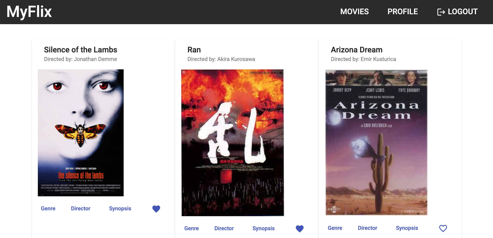

---

# 1. Project description

This App is the **Client side** of the **myFlix API**. (see below for details regarding the REST API and database)

It makes use of Angular 14 Framework.

---

# 2. User Stories

- User will be able to **access information on movies, directors, and genres** so that he
  can learn more about movies he watched or is interested in.

- User will be able to **create a profile so he can save data about his favorite movies**.

---

# 3. How to get the project running

This App can be executed from the terminal usng the following command: **`npm start`**.
Then open url: http://localhost:4200/

---

# 4. Project main dependencies (e.g., JavaScript version, ESLint rules)

- "@angular/animations": "^14.2.0",
- "@angular/cdk": "^14.2.6",
- "@angular/common": "^14.2.0",
- "@angular/compiler": "^14.2.0",
- "@angular/core": "^14.2.0",
- "@angular/forms": "^14.2.0",
- "@angular/material": "^14.2.6",
- "@angular/platform-browser": "^14.2.0",
- "@angular/platform-browser-dynamic": "^14.2.0",
- "@angular/router": "^14.2.0",
- "rxjs": "~7.5.0",
- "tslib": "^2.3.0",
- "zone.js": "~0.11.4"

---

# 5. API used by the project

- myFlix API: https://github.com/xavsln/myFlix_v20220621-1

---

# 6. Online version

- myFlix Angular Client online: https://xavsln.github.io/myFlix-Angular-client/welcome

---
